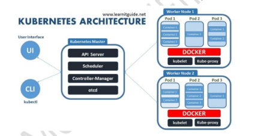

## Kubnernetes Components and Architecture

# K8s Master Node:
                    create cluster and have all the components and sevices that manage , plan ,schedule and moniter all the worker nodes.

                     in a Kubernetes cluster, there can be only one active master node at any time that makes scheduling decisions and manages the cluster's state. However, for high availability, you can set up multiple master nodes where only one is active, and the others are ready to take over if the active master fails. This setup is managed by leader election.

# Worker Node: 
                    Server host application as pods and containers.
                
                    
