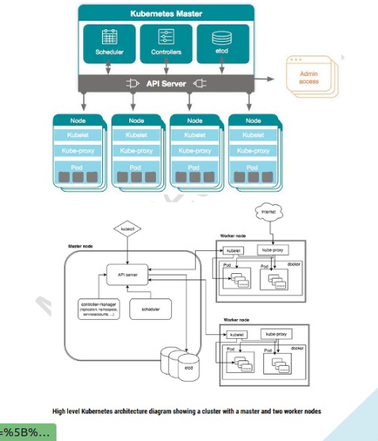

### Worker Node
https://www.upwork.com/services/product/development-it-single-command-deployment-of-ecs-and-cicd-1765336674243350528?ref=fl_profile

1. **kublet**: 
        Main service on the node. connect between Master and Node(worker) and ensurring that the pods and their containers are healthy and running in the desired state.
        also reports health of host running to the Master.

2. **Kube-Proxy**:
            A proxy service runs on each worker node to deal with individual host subnetting and expose services to the external world. It performs request forwarding to the correct pods/containers across the various isolated networks in a cluster

3. **Kubectl**:
            Command Line Tool interacts with kube-apiserver(**on master server** ) and **kublet** and send commands to the master node. Each command is converted to API call. Used to deploy and manage application on the k8s cluster.

        kubectl commands: kubectl run hello-minikube
                          kubectl cluster-info 
                          kubectl get nodes 
                          kubectl get nodes -o wide **check operating system on which cluster is running** 

4. **Container Runtime**: 
                underlying software used to run software. we'll use dockers.

    