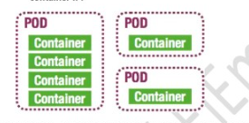

# Kubernetes Concepts

# pod: 

In Kubernetes (K8s), a **pod** is the smallest deployable unit that can be created and managed. It represents a group of one or more containers that share storage, network, and configuration settings and are scheduled to run on a single node. Pods are the basic building blocks of Kubernetes applications and encapsulate one or more application containers, storage resources, and unique network IP, allowing them to communicate with other pods in the cluster.

# Pod that run on a single container:

"One container per pod" is a common design pattern in Kubernetes (K8s) where each pod contains only a single container. It promotes simplicity, isolation, and flexibility, making it a common practice in Kubernetes deployments.

 

# Deployment  